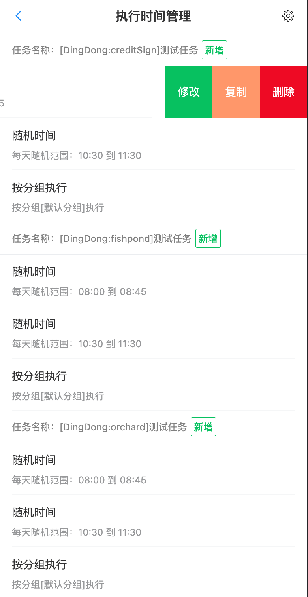

# 简介

- 聚合签到，一次性执行多个APP的签到，薅羊毛等等都不在话下，更多APP逐渐完善中
- 目前已实现的功能如下：
  - 京东京豆签到
  - 蚂蚁积分签到
  - 全家-Fa米家 APP签到
  - 米哈游-原神签到
  - 淘金币签到
  - 叮咚签到
  - 微博积分签到
  - 芭芭农场签到
  - 手机淘宝现金签到
  - ~~柚番短视频 自动刷泡泡~~  
- 部分APP会检测无障碍因此需要[特殊版本的AutoJS](https://github.com/TonyJiangWJ/Auto.js/releases/download/v4.1.22.0621.alpha/AutoJS.fakeIdlefish.arm64.20220621.apk)并关闭原版AutoJS的无障碍权限；
- 部分签到用到了本地OCR建议使用[特殊版本的AutoJS](https://github.com/TonyJiangWJ/Auto.js/releases/download/v4.1.22.0621.alpha/AutoJS.fakeIdlefish.arm64.20220621.apk)或下载ocr插件[mlkit-ocr插件下载](https://github.com/TonyJiangWJ/Auto.js/releases/download/v4.1.1/mlkit-ocr-plugin-latest.apk)
- 因为AutoJSPro的限制，Pro下部分签到将无法正常执行；

## 使用

- 因为部分应用会检测集中某个时间点的签到，检测为异常行为。因此脚本实现的逻辑为每天第一次运行时创建随机的执行计划。所以需要对 `main.js` 设置每天0点的定时任务，用以创建当天的执行计划。
- 运行 `可视化配置.js` 进入 `签到设置`，勾选需要运行的签到任务。对于任务的执行时间设置，选中任务项右划调出按钮 `设置执行时间` 点击进入设置界面，每个任务可以单独设置执行时间或者直接按分组执行，分组需要在 `管理执行分组` 中增加和配置
- 对于需要配置图像的任务，在任务项左滑调出 `更多设置` 进入设置页面配置相应的内容，否则无法正常执行，例如 `叮咚签到` 需要配置各个图像节点
- 执行计划生成完成后可以进入 `签到设置`点击 `查看执行计划` 进行查看和管理，也可以重新生成执行计划
- 可以在配置界面中自行创建执行分组，将不同任务分在不同的组以实现某一时间点的批量执行。
  - 比如叮咚为三个子任务：积分、鱼塘和果园：
  - 将积分签到绑定到默认分组
  - 为鱼塘和果园创建三个分组，随机时间段设置：1：7-9点、2：10-12点、3：16-18点，然后绑定签到任务和对应分组。这样鱼塘和果园就能一天三次完整的领取早中晚的奖励。

## 其他的脚本

- [蚂蚁森林脚本传送门](https://github.com/TonyJiangWJ/Ant-Forest)
- [蚂蚁庄园脚本传送门](https://github.com/TonyJiangWJ/Ant-Manor)
- [开发框架传送门](https://github.com/TonyJiangWJ/AutoScriptBase)

## 推广

- 开发不易，请让我薅点羊毛

  ```log
   下载【抖音极速版】，填我邀请码【8720491405】，新用户当天必得现金红包，可直接提现
  ```

## 界面预览

- 签到设置：
  
- 执行时间设置：
  
- 执行计划管理：
  

## 开发自定义签到脚本

### 定义任务

- 定义任务编号及名称，创建文件 `extends/CustomConfig.js` 可以参考 `extends/CustomConfig-demo.js`

  ```javascript
  module.exports = {
    // 配置自定义的签到任务定义信息
    supported_signs: [
      // ...
      {
        name: '叮咚签到',         // 定义任务名称
        taskCode: 'DingDong',    // 定义任务编号，需要保证唯一
        script: 'DingDong.js',   // 脚本文件名称 需要放在core/目录下
        enabled: true,           // 是否启用
        subTasks: [              // 如果有子任务，可以增加 subTasks 无子任务的不需要增加
          {
            taskCode: 'creditSign',  // 定义子任务编号
            taskName: '积分签到',     // 子任务名称
            enabled: true,           // 是否启用子任务
          },
          // ...
        ]
      },
      // ...
    ]
  }
  ```

- 增加自定义签到任务的配置，创建文件`extends/CustomSignConfig.js` 可以参考 `extends/CustomSignConfig-demo.js`

  ```javascript
  module.exports = function (binder) {
    // 扩展配置
    /**
     * param1: 指定自定义配置的前缀 需要保持唯一
     * param2: 指定自定义配置的初始化值 仅仅保存图片信息时传递空对象即可
     * param3: 指定自定义图像配置的字段列表
     */
    binder.bindCustomSignConfig('bb_farm', {
      click_point: {
        x: 100,
        y: 100,
      }
    }, [
      'collect_btn_alipay', 'entry_check_alipay', 'task_btn_alipay',
      'collect_btn_taobao', 'entry_check_taobao', 'task_btn_taobao'
    ])
  }

  // 在签到代码中调用时参考如下 使用config.{自定义配置前缀}_config来获取配置参数
  let { config } = require('../config.js')(runtime, global)
  console.log('自定义签到配置：', JSON.stringify(config.bb_farm_config.click_point))
  ```

- 任务配置完成后将在第一次运行时自动创建数据库配置，后续再在可视化配置中配置每天的执行时间

### 编写签到脚本

- 增加自定义签到逻辑，需要独立创建一个自定义签到用的js文件放到 `core/` 文件夹下，文件名称需要和上面的 `script:` 相匹配，内容参考如下

  ```javascript
    // 引入常用工具方法
    let { config } = require('../config.js')(runtime, global)
    let singletonRequire = require('../lib/SingletonRequirer.js')(runtime, global)
    let FloatyInstance = singletonRequire('FloatyUtil')
    let widgetUtils = singletonRequire('WidgetUtils')
    let automator = singletonRequire('Automator')
    let commonFunctions = singletonRequire('CommonFunction')
    let localOcrUtil = require('../lib/LocalOcrUtil.js')

    // 引入基本类
    let BaseSignRunner = require('./BaseSignRunner.js')
    // 定义自己的签到
    function SignRunner () {
      // 调用BaseSignRunner.call(this) 实现继承
      BaseSignRunner.call(this)

      // 编写自己的签到执行逻辑
      this.exec = function() {
        // 1.对于无子任务的
        // ...
        // 这里编写签到逻辑，具体可以参考其他的签到文件
        // ...
        // 直接调用，标记当前任务已完成
        this.setExecuted()

        // 2.对于有子任务的需要先判断子任务是否已完成 子任务签到建议封装成单独的方法 具体参考DingDong.js
        if (!this.isSubTaskExecuted({ taskCode: '子任务编号' })) {
          // ...
          // 执行子任务的签到逻辑
          // ...
          // 标记子任务已完成
          this.setSubTaskExecuted({ taskCode: '子任务编号' })
        }

      }
    }
    // 补充继承的模板代码
    SignRunner.prototype = Object.create(BaseSignRunner.prototype)
    SignRunner.prototype.constructor = SignRunner
    // 将自定义签到代码export出去
    module.exports = new SignRunner()
  ```

### 配置任务执行时间

- 运行 `可视化配置.js` 进入签到配置，找到自己添加的任务，左滑调出菜单按钮 `设置执行时间` 点击后进入配置界面，设置每日执行时间即可
- 然后回到上一页，点击 `查看执行计划` 进入后点击 `生成执行计划` 即可自动生成执行计划数据


## 请开发者喝咖啡

- 欢迎使用支付宝或微信请我喝杯咖啡
  - 一元喝速溶、5元喝胶囊、12买全家、33星巴克感激不尽
  
    

- 支付宝扫码领红包，你拿红包我也有份，当然我只有几分。

- 